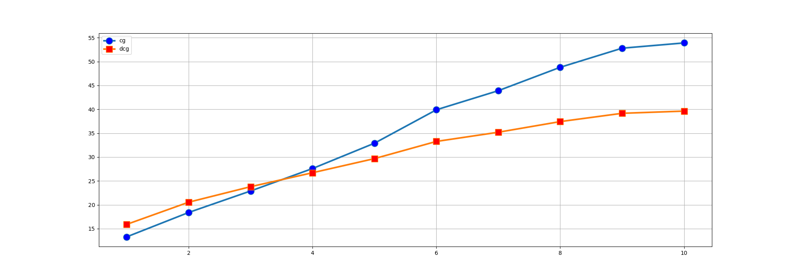

# Modelo vetorial

Neste relatório serão apresentadas as métricas para o sistema de recuperação da informação e a comparação do sistema com e sem a utilização do Stemmer. O sistema que utilizou o stemmer, fez stemming tanto nas consultas quanto no indexador.

## Gráfico de 11 pontos de precisão e recall

Os gráficos a seguir correspondem ao Gráfico de 11 pontos de precisão e recall do sistema sem a ultilização do stemmer e com a ultilização do stemmer, respectivamente.

Comparando o resultado apresentado nos gráficos acima, é possivel perceber que o sistema com a utilização do stemmer apresenta uma precisão maior em todos os pontos. Portanto, o sistema que utiliza o stemmer colocou os arquivos relevantes em uma melhor posição no ranking. A imagem abaixo mostra os dois sistemas no mesmo gráfico, a linha vermelha é o sistema com o stemmer e a linha azul sem stemmer.

## F1

A métrica F1 calculada para os 500 documentos que obtiveram melhor posicionamento no ranking apresentou os seguinte resultados:

Com a utilização do stemmer 0.04799999999999996

Sem a utilização do stemmer 0.04467346938775505

Apesar da diferença ser pequena, o sistema com a utilização do stemmer obteve um melhor resultado.

## Precision@5

A métrica P@5 apresentou o resultado 0.14747474747474745 para a média do P@5 em todas as consultas feitas no teste do sistema com a utilização do stemmer e 0.11717171717171714 para a media do P@5 em todas as consultas feitas no teste do sistema que não utilizou o stemmer. Portanto, na media, o sistema que utilizou o stemmer resultou em mais documentos relevantes nos 5 primeiros docuemntos.

## Precision@10

A métrica P@10 apresentou o resultado 0.14242424242424234 para a media do P@10 em todas as consultas feitas no teste do sistema com a utilização do stemmer e 0.11111111111111108 para a media do P@10 em todas as consultas feitas no teste do sistema que não utilizou o stemmer. Portanto, na média, o sistema que utilizou o stemmer resultou em mais documentos relevantes nos 10 primeiros docuemntos.

## Histograma de R-Precision

Na figura abaixo é apresentado um Histograma de R-Precision.

Nesta imagem o valor positivo significa que o algoritmo A superou o B no resultado de uma determinada consulta, e quando o valor é negativo significa que o algoritmo B superou a A naquela consulta. O algoritmo A é o resultado do sistema com a utilização do stemmer e o algoritmo B é o resultado do sistema sem a utilização do stemmer. Analisando a figura, vemos que na maioria das consultas o sistema com stemmer performou melhor que o sistema sem stemmer.

## MAP

MAP(Mean Average Precision (Média das Médias)) é uma métrica que mede a precisão em cada posição que um novo documento relevante é recuperado.

O resultado do sistema sem o stemmer foi 0.06362497599807357, já o resultado do sistema com a utilização do stemmer foi 0.07789344783489707. Com esse resultado é possivel perceber que o sistema com stemming apresentou um resultado melhor.

## MRR

RR(Reciprocal Rank), é o inverso da primeira resposta correta. E o MRR(Mean Reciprocal Rank) é a media do RR em um conjunto de consultas.

O resultado do sistema sem o stemmer foi 0.24728568965326742, já o resultado do sistema com a utilização do stemmer foi 0.3165736570670526. Com isso é possivel ver que na média o sistema com stemmer apresentou o primeiro resultado correto mais rapido que sem o stemmer.

## Discounted Cumulative Gain

Os gráficos a seguir correspondem ao Discounted Cumulative Gain (médio) do sistema sem a ultilização do stemming e com a ultilização do stemming, respectivamente.

O gráfico do resultado do sistema que utiliza o stemmer, apresentou um DCG maior que o resultado do sistema que utiliza o stemmer para os 10 primeiros documentos. Logo, o sistema que faz stemming retornou ao usuario um ranking dos 10 primeiros documentos melhor que o sistema que não faz stemming

## Normalized Discounted Cumulative Gain

O Normalized Discounted Cumulative Gain(NDCG) do sistema que utilizou o stemmer obteve um resultado melhor em 46 consultas, o que não fez uso do stemmer apresentou um resultado melhor em 22 consultas e não fez diferença em 31 consultas. Logo, quando se leva em conta a relevancia do documento, a utilização do stemmer pelo sistema tem resultado melhor ou igual em 77 consultas

O sistema que utilizou o stemmer apresentou melhor resultado em todas as métricas quando comparado ao sistema que não fez uso do stemmer. Logo, nesta base de dados a utilização do stemmer é recomendada.